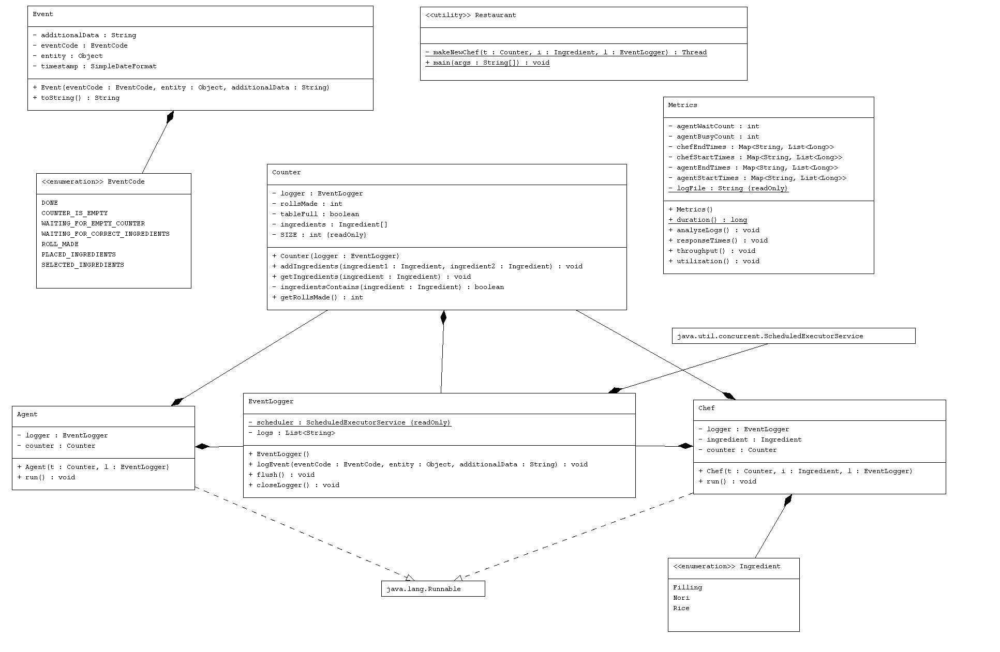

# Events and Measurements Logging Subsystem

## Table of Contents
1. [Overview](#overview)
2. [Structure](#structure)
3. [Setup Guide](#setup-guide)
4. [Documentation](#documentation)
    1. [UML class diagram](#uml-class-diagram)
5. [Contact Information](#contact-information)

## Overview
Implement an event logging subsystem for a multithreaded system with one supplier (agent) thread and three
sushi chef threads (consumers) that measures:
* Response time of each producer (agent) and consumer (chef)
* Throughput capacity (e.g., how many rolls per unit time)
* Utilization of each system component (e.g., how busy each chef or agent is over time)

This system includes an event logging subsystem that captures key events such as ingredient placement, roll 
completion, and waiting/signalling actions. Logs are accumulated in memory and periodically flushed to a 
text file by a background daemon thread using a `ScheduledExecutorService`.

## Structure

### Event.java
- Represents the Event object, responsible for storing the events that occur during the execution
### EventLogger.java
- Represents the event logger, responsible for capturing important events, chefs and agents signalling one another and storing
event logs in a text file
- Handles log flushing with **a Daemon thread**, which accumulates logs in memory and periodically flushes them into the event logs text file
  - Uses Java concurrency utilites for scheduling, in particular the `ScheduledExecutorService`
### EventCode.java
- Enum representing the possible event codes, such as `ROLL_MADE` and `WAITING_FOR_EMPTY_COUNTER`
### Metrics.java
- Represents the Metric Analyzer, responsible for reading the event logs text file and outputting the response time for each producer/consumer,
throughput and utilization
  - How long between the time the agent is notified and the time they finish placing ingredients
  - How long between a chef noticing the missing ingredients are available and actually produces the roll
  - How many rolls were completed over the total execution time
  - Ratio of busy vs. waiting time for each thread
### Agent.java
- Represents the Agent(supplier), responsible for selecting ingredients at random and placing on the counter
- Implements the Runnable interface
### Chef.java
- Represents the Chef, responsible for creating sushi rolls using the ingredients on the counter and their own personal ingredient
- Implements the Runnable interface
### Counter.java
- Represents the counter, a shared space between agent and chef which stores the ingredients provided by agent and sends to all chefs
### Ingredient.java
- Enum representing the possible ingredients and a randomizer method that selects two random ingredients (Rice, Nori or Filling)
### Restaurant.java
- Handles the creation and running of all threads

## Setup Guide
1. Clone or download the project to your computer
2. Open the project in your preferred IDE (Intellij preferred)
3. Compile the project using your IDE, build the project
4. Execute the `Restaurant.java` file, and observe the output

## Expected Output
In terminal, you should see one agent thread select 2 random ingredients and place on table (counter), 
and then a sushi roll be generated by a specific chef, with a maximum of 20 rolls. Once threads complete running,
observe the terminal for the metrics analysis, showcasing the average response times for each thread, the throughput
and the utilization percentages for each thread.

## Documentation
Below you can find a UML sequence diagram and a UML class diagram of the system
### UML class diagram

## Contact Information
Mahad Ahmed
101220427
